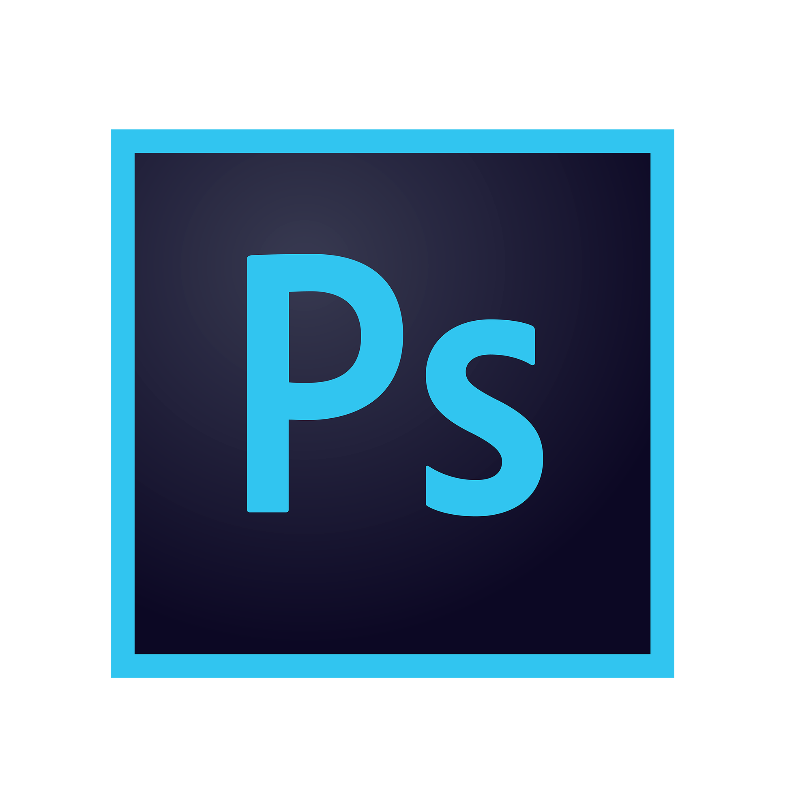

# FoxesWorld


## GitHub Statistics

<p align="center">
  
  <br>
  
  
</p>

---

## Languages Known

<p align="left">
  <a href="https://en.wikipedia.org/wiki/Java_(programming_language)">
    
  </a>
  <a href="https://en.wikipedia.org/wiki/HTML">
    
  </a>
  <a href="https://en.wikipedia.org/wiki/JavaScript">
    
  </a>
  <a href="https://en.wikipedia.org/wiki/PHP">
    
  </a>
</p>

---

## Tools Used

<p align="left">
  <a href="https://en.wikipedia.org/wiki/IntelliJ_IDEA">
    
  </a>
  <a href="https://en.wikipedia.org/wiki/JetBrains#IDEs">
    
  </a>
  <a href="https://en.wikipedia.org/wiki/Adobe_Photoshop">
    
  </a>
  <a href="https://en.wikipedia.org/wiki/Notepad++">
    
  </a>
</p>

---

## About

- Try Discord - `.aidenfox.`
```

